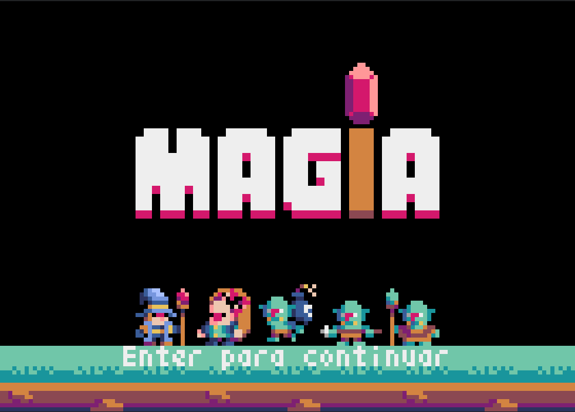
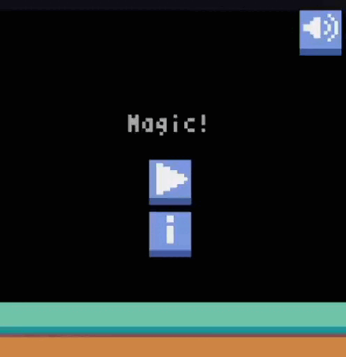

  <h4>🚧⚠️Em desenvolvimento...⚠️🚧</h4>

    <h3>Sobre o projeto</h3>
    
Controle um mago, lute contra goblins e sobreviva o máximo possível.

  

    
    
  

  <h3>Resultado</h3>
  

    
    
      
    
    
  

