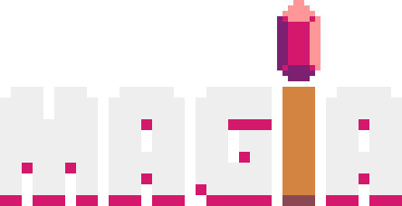

### Sobre o projeto
### 🚧⚠️Em desenvolvimento...⚠️🚧

Controle um mago, lute contra goblins e sobreviva o máximo possível.

Criado através da linguagem python, utilizando a interface gráfica da game engine Pyxel.

 
 

### Resultado

